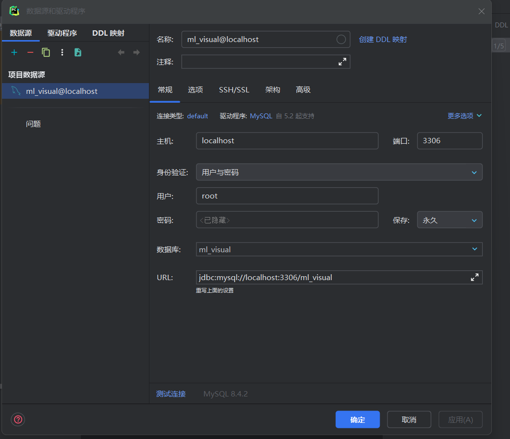

# 前端安装
1. 安装 Node.js https://nodejs.org/en/download/prebuilt-installer
2. `cd frontend`
3. `npm install`

# 后端安装
1. 安装 PyCharm https://www.jetbrains.com/pycharm/download
2. 安装 Python ，或者直接安装 Anaconda 然后使用 Anaconda 的 Python
3. `cd ML_visual_backend`
4. `pip install -r requirements.txt`
5. 安装 MySQL https://dev.mysql.com/downloads/mysql ，username: root, password: root
6. 安装 MySQL Workbench https://dev.mysql.com/downloads/workbench
7. 打开 MySQL Workbench 连接数据库（Local Instance），新建 schema: 命名 ml_visual, 点击apply
8. `python manage.py migrate`
9. IDE中配置数据库 
10. PyCharm 右上角直接运行 或者 `python manage.py runserver localhost:8080`