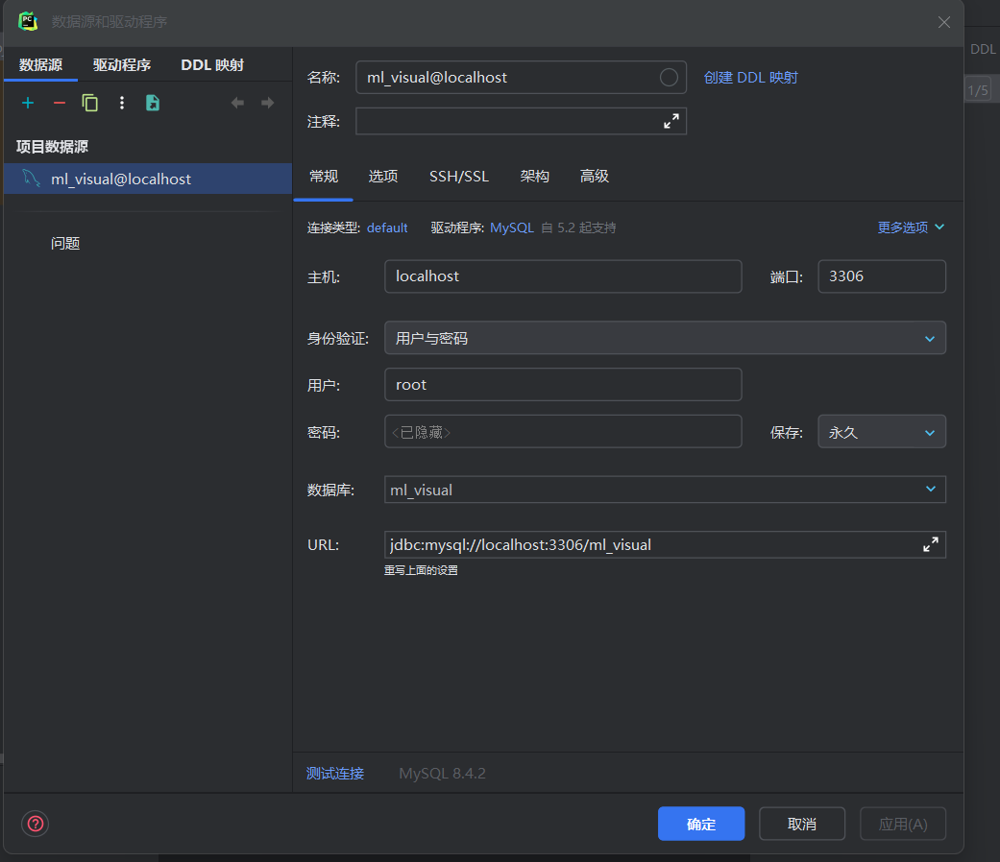

# Notes

## 1. 如何添加新的模块

### 1.1 前端

1. 在`frontend/src/views/HomeView/AlgView` 目录下添加新的页面组件，例如`NewAlgView.vue`。
2. 在`frontend/src/router/index.js`文件中添加新的路由。
3. 在`frontend/src/views/HomeView/HomeView.vue`文件中添加新的菜单项。

### 1.2 后端

1. 在`ML_visual_backend/app/alg`目录下添加新的算法模块，例如`new_alg.py`。
2. 在`ML_visual_backend/app/views.py`文件中添加新的接口。
3. 在`ML_visual_backend/ML_visual_backend/urls.py`文件中添加新的路由。

## 2. 如何实现前后端交互

### 2.1 前端

1. 在新的页面组件（`NewAlgView.vue`）中使用封装好的`request`发送请求。注意请求的`url`前面会自动加上`/api`。
2. 获取返回信息，更新页面。
3. jwt已实现，请求会自动携带token。

### 2.2 后端

1. 在`views.py`文件中添加的新的接口函数中接收前端传来的参数。
2. 调用`app/alg`目录下的算法模块，获取结果。
3. 返回结果。
4. jwt已实现，若需要进行身份认证，直接调用`validate_token`函数即可。该函数会返回当前用户名。

## 3. 如何使用 swagger

1. 如何快速整合 Swagger 到 Django 项目中？ https://apifox.com/apiskills/django-integration-swagger/
2. 如何将 Swagger 导入到 Apifox 平台？ https://apifox.com/blog/how-to-migrate-from-swagger-to-apifox/
3. 如何将 Swagger 导出为 JSON、Markdown、PDF、Word 文档 https://apifox.com/apiskills/how-to-export-swagger-md-pdf-word/

## 4. 如何启动项目
### 4.1 前端安装
1. 安装 Node.js https://nodejs.org/en/download/prebuilt-installer
2. `cd frontend`
3. `npm install`

### 4.2 后端安装
1. 安装 PyCharm https://www.jetbrains.com/pycharm/download
2. 安装 Python ，或者直接安装 Anaconda 然后使用 Anaconda 的 Python
3. `cd ML_visual_backend`
4.  创建虚拟环境并激活``python -m .venv`， `.venv\Scripts\activate` 
5. `pip install -r requirements.txt`
6. 安装 MySQL https://dev.mysql.com/downloads/mysql ，username: root, password: root
7. 安装 MySQL Workbench https://dev.mysql.com/downloads/workbench
8. 打开 MySQL Workbench 连接数据库（Local Instance），新建 schema: 命名 ml_visual, 点击apply
9. `python manage.py migrate`
10. IDE中配置数据库（屏幕右方的选项） 
11. PyCharm 右上角直接运行 或者 `python manage.py runserver localhost:8080`

