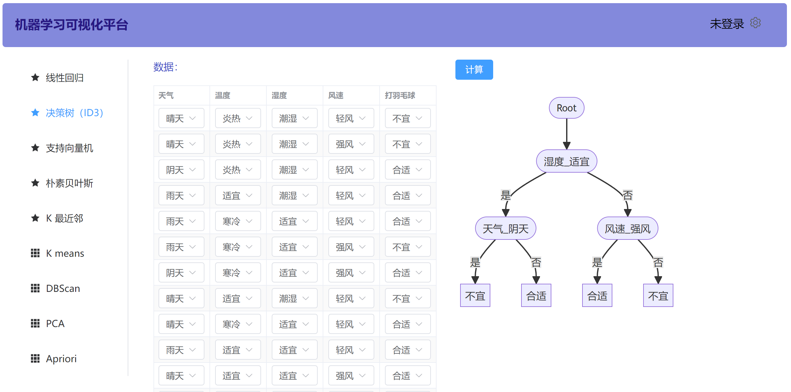

# 机器学习可视化平台

## 1. 项目介绍

### 1.1 技术栈
* 前端： Vue + ElementUI + Chart.js + mermaid
* 后端： Django + JWT + Swagger + Sklearn
* 数据库： MySQL

### 1.2 项目进度
* 目前已实现：
    * 前端框架
    * 后端框架
    * 用户注册、登录
    * 线性回归可视化
    * 决策树（ID3）可视化
    
      
* TODO：
    * 其他算法的可视化
    * 管理员功能（非必要）

### 1.3 运行
* 前端
    * `cd frontend`
    * `npm install` or `cnpm install`
    * `npm run dev`
* 后端
    * `cd ML_visual_backend`
    * `pip install -r requirements.txt`
    * 根据实际情况修改settings.py中的 DATABASES 配置
    * `python manage.py migrate`
    * `python manage.py runserver localhost:8080`

## 2. 运行实例

### 2.1 用户注册

### 2.2 用户登录

### 2.3 线性回归

### 2.4决策树（ID3）

